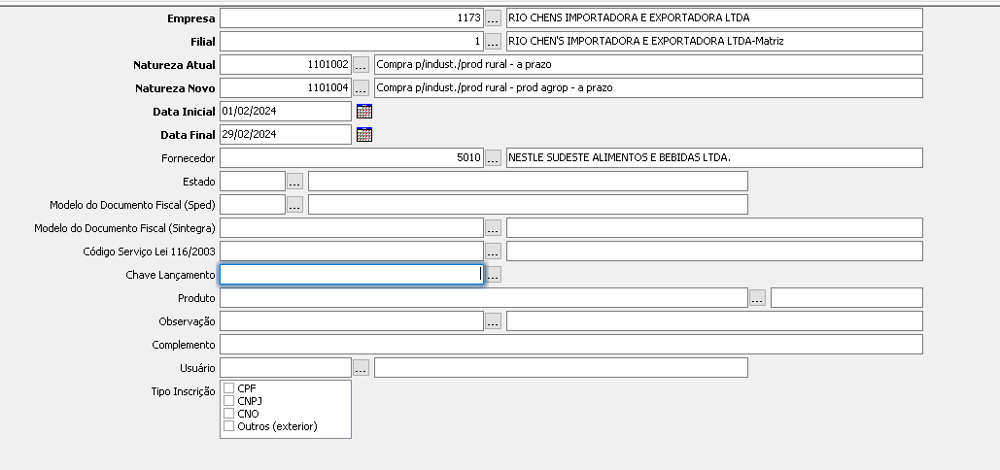
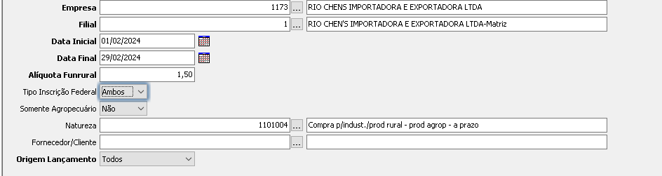

# Comparar Lançamentos Funrural

Encontra as notas que possuem o funrural através do número da notas e valor.

## Como usar

- Baixe o arquivo modelo e preencha as colunas `nota` e `valor` ou crie um arquivo **.csv** que contenha as colunas na mesma ordem.
- Dentro do programa selecione o arquivo e preencha os campos `Empresa`, `Filial`, `Data Inicio`, `Data Final`.
- Clique no botão _processar_
- As chaves de lançamento do serão exibidas no campo `Chave de Lançamento Funrural`.

  - Em `Utilitários` > `Entradas` > `Documento Fiscal` > `Alterar Código Fiscal de Operação`
  - Preencha `Natureza Atual` e `Natureza Novo` com os CFPs Correspindentes.
  - Preencha as Chaves de Lnaçamentos e processa a Rotina.

  

  - Em `Utilitários` > `Entradas` > `Documento Fiscal` >`Gerar/Atualizar Funrural`

  - Preencha `Natureza` com a onva natureza e execute a rotina.

  

## Relatório e Backup

- O sistema acrescenta um coluna extra no csv indicando se a linha é inválida ou o arquivo foi encontrado ou não.
- Um aquivo com suffixo `_bpk` e gerado com valores originais do arquivo importado.
